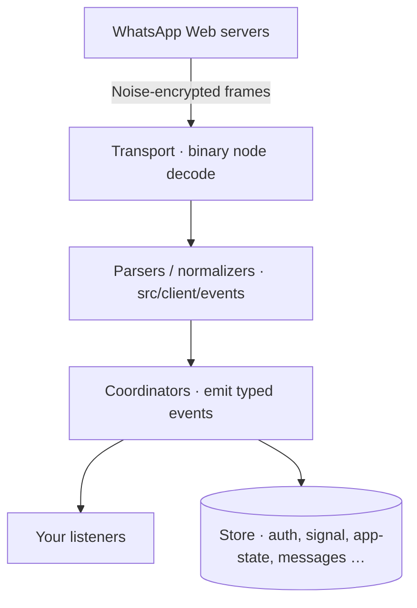

# Architecture
Source: https://zapo.to/en/concepts/architecture

How the WaClient, coordinators, stores, transport, and event flow fit together inside zapo, and how data moves from WhatsApp into your code.

`zapo` is organized around a thin **client** that delegates every feature to a focused **coordinator**. The client owns the connection, authentication, and event emitter; coordinators own the domain logic.

## The client

[`WaClient`](/en/reference/client) is the single entry point. You construct it with options and an optional logger, then call `connect()`:

```ts theme={null}
const client = new WaClient({ store, sessionId: 'default' }, logger)
await client.connect()
```

The client itself exposes only a small surface: connection lifecycle (`connect`, `disconnect`, `logout`), state queries (`getState`, `getCredentials`), and the typed event emitter (`on`, `once`, `off`). Everything else lives behind a coordinator getter.

## Coordinators

Each coordinator is reached through a getter on the client. They are lazily wired at construction and are safe to hold references to.

| Getter                 | Coordinator                     | Responsibility                                  |
| ---------------------- | ------------------------------- | ----------------------------------------------- |
| `client.auth`          | `WaAuthClient`                  | Pairing, credentials, registration state        |
| `client.message`       | `WaMessageCoordinator`          | Send/receive, receipts, media download, addons  |
| `client.presence`      | `WaPresenceCoordinator`         | Own/peer presence and chat-state                |
| `client.chat`          | `WaAppStateMutationCoordinator` | Chat settings: mute, pin, archive, read, delete |
| `client.group`         | `WaGroupCoordinator`            | Groups and communities                          |
| `client.newsletter`    | `WaNewsletterCoordinator`       | Channels: create, send, follow, admin           |
| `client.status`        | `WaStatusCoordinator`           | Status broadcast send and reactions             |
| `client.broadcastList` | `WaBroadcastListCoordinator`    | Broadcast list management and sends             |
| `client.privacy`       | `WaPrivacyCoordinator`          | Privacy categories, blocklist                   |
| `client.profile`       | `WaProfileCoordinator`          | Profile picture, status text, username          |
| `client.business`      | `WaBusinessCoordinator`         | Business profile, verified names                |
| `client.bot`           | `WaBotCoordinator`              | Bot profiles and prompts (Meta AI and others)   |
| `client.email`         | `WaEmailCoordinator`            | Bind/verify email on the account                |
| `client.lowlevel`      | `WaLowLevelCoordinator`         | Raw node send/query escape hatch                |

Because the coordinator types are exported from the package root, you can annotate them in TypeScript:

```ts theme={null}
import type { WaGroupCoordinator } from 'zapo-js'

const groups: WaGroupCoordinator = client.group
```

## Data flow



* **Incoming**: frames are decoded into binary nodes, parsed and normalized into typed event payloads, then emitted (`message`, `receipt`, `group`, …).
* **Outgoing**: your call to a coordinator (e.g. `client.message.send`) is built into a protocol node, encrypted, and written to the socket; the coordinator resolves once the server acks.

## Engineering conventions

If you read the source, these conventions are pervasive and explain a lot of the API shape:

* **`Uint8Array` everywhere** for binary data (`Buffer` is avoided), with zero-copy views in hot paths.
* **Named exports only** — there are no default exports.
* **No enums** — constants use `Object.freeze({ ... } as const)`, surfaced as the `WA_*` objects.
* **Bounded in-memory structures** to prevent unbounded growth in long-lived processes.

## Next

<CardGroup>
  <Card title="Authentication" icon="qrcode" href="/en/concepts/authentication">
    Pairing with QR or an 8-character code, and credential lifecycle.
  </Card>

  <Card title="Events" icon="bell" href="/en/concepts/events">
    The full event map and how to listen.
  </Card>

  <Card title="Stores" icon="database" href="/en/concepts/stores">
    Providers, domains, and backends.
  </Card>

  <Card title="Configuration" icon="sliders" href="/en/concepts/configuration">
    Every `WaClientOptions` field explained.
  </Card>
</CardGroup>

