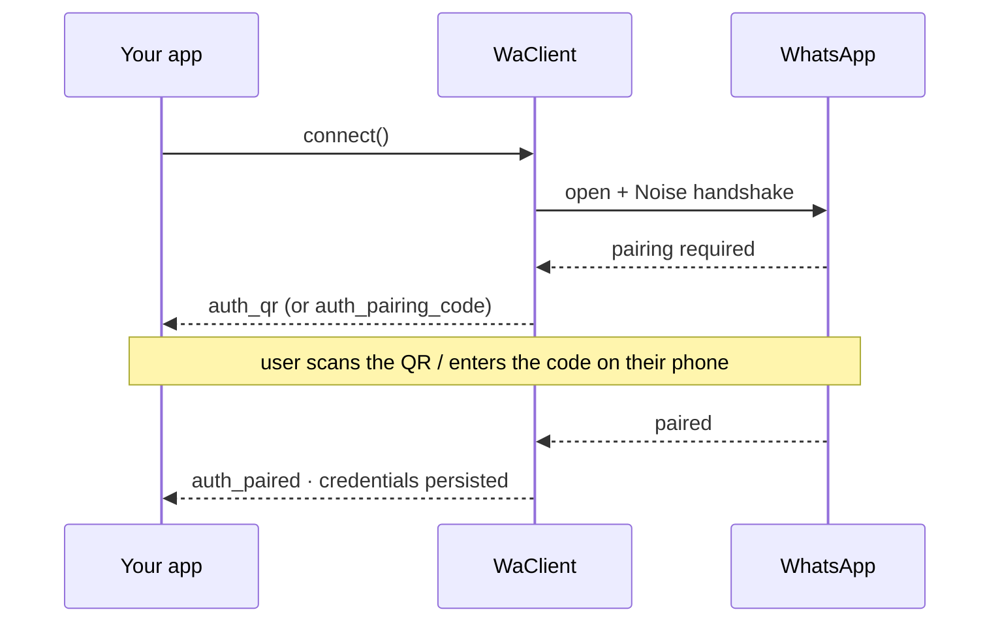

# Authentication
Source: https://zapo.to/en/concepts/authentication

Pair a device with a QR code or 8-character pairing code, persist Noise credentials across restarts, and cleanly log out of a WhatsApp session.

`zapo` connects as a **companion device** — exactly like linking WhatsApp Web or Desktop. The first connection pairs the device; after that, credentials stored in your [store](/en/concepts/stores) are reused automatically.

## The pairing flow

Pairing is driven entirely through events emitted during `connect()`:



| Event                   | Payload                              | When                                                       |
| ----------------------- | ------------------------------------ | ---------------------------------------------------------- |
| `auth_qr`               | `{ qr: string, ttlMs: number }`      | A new QR is available to render. Re-emitted as it rotates. |
| `auth_pairing_code`     | `{ code: string }`                   | An 8-character pairing code was issued (code flow).        |
| `auth_pairing_required` | `{ forceManual: boolean }`           | The session needs pairing input.                           |
| `auth_paired`           | `{ credentials: WaAuthCredentials }` | Pairing succeeded; credentials are now persisted.          |

Once `auth_paired` fires, the credentials are written to the store and reused on every subsequent `connect()` — you will not see `auth_qr` again unless the session is unlinked or cleared.

<Check>
  Paired. Credentials now live in your store — restart the process and `connect()` resumes the session with no new QR.
</Check>

## Pairing with a QR code

This is the default flow. Render the `qr` string as a QR image and scan it from **WhatsApp → Linked devices → Link a device**.

```ts theme={null}
import qrcode from 'qrcode-terminal'

client.on('auth_qr', ({ qr, ttlMs }) => {
  qrcode.generate(qr, { small: true })
  console.log(`QR valid for ${ttlMs}ms`)
})

client.on('auth_paired', ({ credentials }) => {
  console.log('Paired as', credentials.meJid)
})

await client.connect()
```

The QR rotates automatically; `auth_qr` fires again with a fresh value each time, so always render the latest one.

## Pairing with a code

Prefer entering an 8-character code on the phone instead of scanning? Request one through `client.auth` after the connection is established. Listen for `auth_pairing_required`, then request the code for the target phone number (digits only, with country code):

```ts theme={null}
client.on('auth_pairing_required', async () => {
  const code = await client.auth.requestPairingCode('5511999999999')
  // Format for display, e.g. "ABCD-1234"
  console.log('Enter on your phone:', code.match(/.{1,4}/g)?.join('-'))
})

client.once('auth_paired', () => console.log('Paired!'))

await client.connect()
```

<Note>
  `requestPairingCode(phoneNumber, shouldShowPushNotification?, customCode?)` requires an active connection and returns the code as a string. On the phone, open **Linked devices → Link with phone number instead**.
</Note>

## Credentials

After pairing, the current credentials are available synchronously:

```ts theme={null}
const credentials = client.getCredentials() // WaAuthCredentials | null
console.log(credentials?.meJid)
```

<Warning>
  `WaAuthCredentials` contains the device's secret keys. It is marked `@sensitive` for a reason: anything that can read these can impersonate the device. If you persist them outside the built-in store, encrypt them at rest.
</Warning>

## Logging out

`logout()` unpairs the companion device server-side (it removes this device from the account's linked devices). It requires an authenticated session:

```ts theme={null}
await client.logout()
```

By default this also clears stored state. You can control exactly which store domains are wiped on logout via the `logoutStoreClear` option — see [Configuration](/en/concepts/configuration#logout-store-clearing).

## Disconnect vs. logout

|                    | `disconnect()`                               | `logout()`                |
| ------------------ | -------------------------------------------- | ------------------------- |
| Closes the socket  | Yes                                          | Yes                       |
| Keeps credentials  | **Yes** — reconnect later without re-pairing | No — device is unlinked   |
| Server-side effect | None                                         | Removes the linked device |

Use `disconnect()` for a graceful shutdown you intend to resume; use `logout()` to permanently unlink.

## Next

<CardGroup>
  <Card title="Stores" icon="database" href="/en/concepts/stores">
    Where credentials and Signal state are persisted.
  </Card>

  <Card title="Reconnection" icon="arrows-rotate" href="/en/guides/reconnection">
    Handle `connection: close` and reconnect.
  </Card>
</CardGroup>

