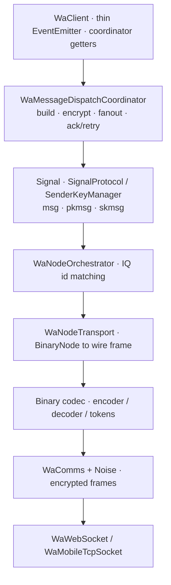
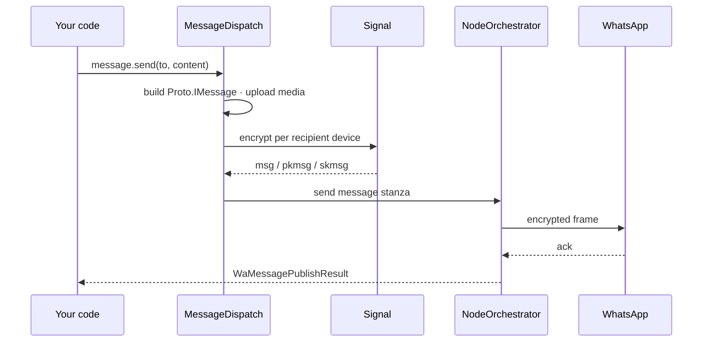

# Architecture in depth
Source: https://zapo.to/en/concepts/internals

How zapo handles Noise handshakes, Signal sessions, prekey rotation, sender keys, app-state mutations, and the write-behind store internally.

This page goes deeper than the [architecture overview](/en/concepts/architecture) — into the subsystems and data flows inside `zapo`. It's aimed at contributors and anyone debugging at the protocol level. For the protocol itself, see [The WhatsApp protocol](/en/concepts/protocol).

## Module map

<Tree>
  <Tree.Folder name="src">
    <Tree.Folder name="client">
      <Tree.File name="WaClient.ts" />

      <Tree.File name="WaClientFactory.ts" />

      <Tree.Folder name="coordinators" />
    </Tree.Folder>

    <Tree.Folder name="transport">
      <Tree.Folder name="noise" />

      <Tree.Folder name="binary" />

      <Tree.Folder name="node" />
    </Tree.Folder>

    <Tree.Folder name="signal" />

    <Tree.Folder name="crypto" />

    <Tree.Folder name="message" />

    <Tree.Folder name="appstate" />

    <Tree.Folder name="store" />

    <Tree.Folder name="auth" />

    <Tree.Folder name="media" />

    <Tree.Folder name="retry" />

    <Tree.Folder name="protocol" />

    <Tree.Folder name="infra" />

    <Tree.Folder name="util" />
  </Tree.Folder>
</Tree>

| Directory        | Responsibility                                                           |
| ---------------- | ------------------------------------------------------------------------ |
| `src/client/`    | Client orchestration, coordinators, connection lifecycle, event routing. |
| `src/transport/` | Socket, Noise handshake, binary node codec, node orchestration.          |
| `src/signal/`    | Signal sessions, ratchet (1:1), sender keys (groups), key generation.    |
| `src/crypto/`    | Primitives: AES-GCM/CBC/CTR, SHA, HMAC, HKDF, Curve25519/Ed25519.        |
| `src/message/`   | Outgoing build/encode + incoming parse/decrypt pipeline.                 |
| `src/appstate/`  | App-state sync engine (mutations, snapshots, crypto, MACs).              |
| `src/store/`     | Store contracts + memory providers; persistence boundary.                |
| `src/auth/`      | Pairing/QR/credential flows.                                             |
| `src/media/`     | Media upload/download/encryption.                                        |
| `src/retry/`     | Retry tracking for failed sends/decryptions.                             |
| `src/protocol/`  | Constants (node tags, IQ types, xmlns) and JID helpers.                  |
| `src/infra/`     | Logging, bounded collections, locks, perf utilities.                     |
| `src/util/`      | Byte/async/primitive helpers.                                            |

## The stack

Stores cut across every layer; the connection manager and keep-alive sit beside the transport.

## Connection lifecycle

`WaConnectionManager` (in `src/client/connection/`) drives connect/disconnect:

1. `WaComms` opens the socket (`WaWebSocket` or `WaMobileTcpSocket`) and runs the **Noise** handshake (`src/transport/noise/`), authenticating the server and deriving session keys.
2. `WaNodeTransport.bindComms()` attaches the binary codec to the encrypted socket.
3. `WaKeepAlive` (`src/transport/keepalive/`) starts periodic ping IQs to detect a dead socket and estimate server clock skew.
4. The client runs post-connect passive tasks (history sync, offline-message drain) and emits [`connection`](/en/concepts/events#auth--connection).

`zapo` deliberately does **not** auto-reconnect — that policy belongs to your app (see [Reconnection](/en/guides/reconnection)).

## Outgoing message pipeline

`client.message.send` → `WaMessageDispatchCoordinator`:

1. **Build** — content (the [send union](/en/reference/message-types)) is built into a `Proto.IMessage`, uploading media if needed.
2. **Resolve devices** — the recipient's device list is resolved (fanout, `src/client/messaging/`), fetching prekey bundles for devices without a session.
3. **Encrypt** — per device: 1:1 via the Signal ratchet (`SignalProtocol` → `msg`/`pkmsg`), groups via `SenderKeyManager` (`skmsg`) plus sender-key distribution to members who need it. Your own devices get a `deviceSentMessage`.
4. **Assemble** — `src/transport/node/builders/message.ts` wraps the encrypted participants into one `<message>` stanza with the device identity, participant hash, and `addressing_mode` (pn/lid).
5. **Send & ack** — `WaNodeOrchestrator.sendNode()` encodes and writes it; the coordinator waits for the server `<ack>` and returns a [`WaMessagePublishResult`](/en/guides/sending-messages). Failures are retried per the configured attempts/backoff.

## Incoming pipeline

1. `WaComms` decrypts a Noise frame; `WaNodeTransport.dispatchIncomingFrame()` decodes it into a `BinaryNode`.
2. `WaIncomingNodeCoordinator` routes by tag/type to the right handler (`src/client/events/`).
3. For messages, the body is decrypted (Signal ratchet or sender key), device-sent wrappers are unwrapped, and PKCS7 padding removed (`src/message/primitives/incoming.ts`).
4. The result is normalized into a typed payload and emitted (`message`, `receipt`, `group`, …). A [stanza filter](/en/reference/low-level#filtering-inbound-stanzas) can drop stanzas before handlers run; the coordinator still acks `message`/`receipt`/`notification` so the server stops re-delivering.

Decryption failures are tracked and can trigger a retry-receipt so the sender re-encrypts.

## App-state engine

`WaAppStateSyncClient` (`src/appstate/`) reconciles per-account settings:

* A sync sends the last known version per collection; the server returns **patches** (or a full **snapshot**).
* Each mutation's index and value are MAC-verified and the value decrypted (`WaAppStateCrypto`: AES-CBC + HMAC, per-collection keys derived via HKDF).
* Verified mutations are applied to the `appState` store and surfaced as [`mutation`](/en/concepts/events#state-history--mex) events.
* **Contact sink** — winning `Contact` mutations (including the snapshot ones at pair-time) stream into the `contacts` store unconditionally, bootstrapping the address book on first connect independent of the public `emitSnapshotMutations` toggle. The sink resolves the LID-canonical JID from `contactAction.lidJid`, mirrors the PN form into `phoneNumber`, and writes `fullName ?? firstName` as `displayName`. History-sync additionally persists `inlineContacts` and per-conversation `displayName` / `username` when the primary device forwards them; the pair payload advertises `supportInlineContacts` so the server knows to ship those.
* Outgoing changes from [`client.chat`](/en/reference/chat-mutations) are encoded as mutations, batched, and flushed.

## Store layer

The store is split into **contracts** (`src/store/contracts/` — the interface each domain implements) and **providers** (the built-in `memory` provider, plus the external [backend packages](/en/reference/stores)). This is what lets you mix backends per domain in [`createStore`](/en/concepts/stores).

Two performance boundaries sit here:

* **Write-behind** — incoming messages/threads/contacts are batched and flushed asynchronously (tuned via [`writeBehind`](/en/concepts/configuration#write-behind-persistence)) so the hot path isn't blocked on the database.
* **Bounded caches** — `retry`, `groupMetadata`, `deviceList`, and `messageSecret` are bounded in-memory with TTLs to prevent unbounded growth in long-lived processes.

## Reliability

* **Retry tracker** (`src/retry/`) — maps failed message ids to retry metadata and enforces attempt/backoff limits.
* **Receipt queue** (`WaReceiptQueue`) — buffers receipts that fail to send during a disconnect, replaying them on reconnect (bounded to avoid growth).
* **Keep-alive** — periodic ping IQs detect dead sockets and measure clock skew; it skips pinging while a query is already in flight.

## Client composition

`WaClientFactory` is the composition root: it constructs the auth client, connection manager, transport + orchestrator, keep-alive, Signal/sender-key managers, app-state client, stores, and every feature coordinator, then injects them into `WaClient`. `WaClient` itself stays thin — an `EventEmitter` exposing coordinator getters and the connection lifecycle.

## Crypto

`src/crypto/` provides the primitives:

* **Symmetric** — AES-GCM (Noise, app-state values), AES-CBC (sender keys), AES-CTR (media).
* **Hash/MAC/KDF** — SHA-1/256/512, HMAC, HKDF.
* **Elliptic curve** — Curve25519 (X25519 DH) and Ed25519/XEdDSA signatures.

Everything here is **synchronous except the elliptic-curve operations**, which are async. Keeping the rest of crypto synchronous removed per-call async overhead and measurably improved throughput on the hot paths; the curve operations stay async by design.

## Conventions

These hold across the codebase and explain much of the API shape:

* `Uint8Array` everywhere for binary data; `Buffer` is avoided. Zero-copy (`subarray`, byte views) in critical paths.
* Bounded in-memory structures to prevent unbounded growth.
* Named exports only; no default exports.
* No enums — constants use `Object.freeze({ … } as const)`, surfaced as the `WA_*` objects.
* Path aliases (`@client`, `@crypto`, `@store`, …) instead of relative `../` imports.

