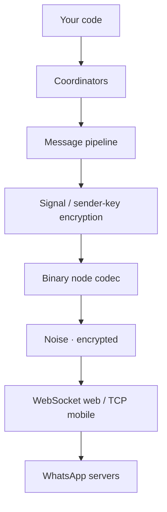

# The WhatsApp protocol
Source: https://zapo.to/en/concepts/protocol

A tour of the WhatsApp multi-device protocol — Noise transport, XML stanzas, Signal encryption, and how zapo implements each layer in TypeScript.

`zapo` is an independent, from-scratch implementation of the WhatsApp multi-device protocol. This page explains what the protocol looks like on the wire and points at the modules where `zapo` handles each layer. You don't need any of it to use the library — it's here for the curious and for contributors.

<Note>
  The protocol-definition artifacts under `spec/` (protobuf, app-state, and MEX schemas) are generated from the open [`vinikjkkj/wa-spec`](https://github.com/vinikjkkj/wa-spec) repository, which tracks the WhatsApp protocol definitions.
</Note>

## The layers

From the socket up:



## Transport & the Noise handshake

WhatsApp doesn't speak plain WebSocket — every byte after connect is wrapped in a **Noise protocol** session (an `XX`-style handshake using Curve25519, AES-GCM, and SHA-256). The handshake authenticates the server, negotiates session keys, and from then on every frame is AES-GCM encrypted with a counter nonce.

In `zapo`:

* `src/transport/WaComms.ts` owns the socket + Noise lifecycle.
* `src/transport/noise/` implements the handshake state machine (`WaNoiseHandshake`), the encrypted socket wrapper, and the login/registration **client payload** (device metadata, app version, locale).
* The socket itself is pluggable: `src/transport/WaWebSocket.ts` for the browser/Node WebSocket (companion mode), `src/transport/node/WaMobileTcpSocket.ts` for the raw TCP transport ([mobile mode](/en/concepts/mobile)).

## Stanzas: the binary node codec

Inside the Noise tunnel, WhatsApp speaks a compact binary form of XMPP-like **stanzas**. `zapo` models every stanza as a [`BinaryNode`](/en/reference/low-level#binary-nodes):

```ts theme={null}
interface BinaryNode {
  tag: string
  attrs: Record<string, string>
  content?: Uint8Array | string | readonly BinaryNode[]
}
```

The wire format uses a **token dictionary** (common strings like `s.whatsapp.net` are single bytes), nibble/hex packing for JIDs and numbers, and optional compression. `zapo`'s codec lives in `src/transport/binary/` (`encoder.ts`, `decoder.ts`, `tokens.ts`) and is written for **zero-copy** — the decoder returns `subarray` views over the received bytes instead of copying.

## Requests & responses (IQ)

Many operations are request/response **IQ** stanzas (`<iq type="get|set">` → `<iq type="result|error">`), correlated by a stanza `id`. `src/transport/node/WaNodeOrchestrator.ts` assigns ids, tracks in-flight queries in a map, and resolves the matching response (or times out). The typed coordinators are built on top of this; you can reach it directly via [`client.lowlevel.query`](/en/reference/low-level#issuing-an-iq).

## End-to-end encryption (Signal)

Message bodies are end-to-end encrypted with the **Signal protocol**. `zapo` implements it in `src/signal/` on top of the primitives in `src/crypto/`:

* **Identity & prekeys** — each device has a long-term identity key and a set of one-time prekeys. Establishing a session with a new peer fetches their prekey bundle.
* **1:1 chats** — a Double-Ratchet session encrypts each message. On the wire the envelope is `msg` (an established session) or `pkmsg` (a prekey message that also bootstraps the session).
* **Groups** — a **sender-key** scheme (`skmsg`): each member distributes a sender key once, then encrypts group messages symmetrically (AES-CBC) under it. Distribution messages ride along to members who don't have your sender key yet.

The envelope discriminator (`'msg' | 'pkmsg' | 'skmsg'`) appears throughout as the encrypted message type.

## Multi-device & fanout

WhatsApp is **multi-device**: an account is a set of devices, and a message must be encrypted **once per recipient device**. `zapo` resolves the device list for each recipient, establishes Signal sessions as needed, and fans the ciphertext out into a single `<message>` stanza. Recipients are addressed either by phone-number JID or by [LID](/en/concepts/identities), the `addressing_mode` chosen from group membership. Your own other devices receive a `deviceSentMessage` copy so all your devices stay in sync.

## App-state sync

Settings that must look the same on every device — mute, pin, archive, read state, labels, contacts — are **not** messages. They sync through a separate **app-state** channel: encrypted, MAC'd **mutations** layered into collections, reconciled with an LT-hash so devices converge. `zapo` implements this in `src/appstate/` (`WaAppStateSyncClient` + `WaAppStateCrypto`) and surfaces it through [`client.chat`](/en/reference/chat-mutations) and the [`mutation`](/en/concepts/events#state-history--mex) event.

## Media

Media isn't sent inline. The bytes are encrypted with a per-message media key (AES-CBC + HMAC) and uploaded to a WhatsApp CDN; the stanza carries the URL, keys, and digests. The recipient downloads and decrypts. `zapo` handles upload/download in `src/media/` — see the [media guide](/en/guides/media).

## MEX (GraphQL)

Newer surfaces — newsletters, parts of business, some notifications — use **MEX**, a GraphQL-over-IQ layer. `zapo` wraps these queries in the relevant coordinators (e.g. [`client.newsletter`](/en/guides/newsletters)); the optional [`argo-codec`](/en/installation#optional-peer-dependencies) peer decodes certain MEX responses.

## Design choices

`zapo` makes deliberate, protocol-informed choices:

* **`index-first`** — behavior is validated against WhatsApp Web before it's implemented.
* **`performance-first`** — `Uint8Array` everywhere, zero-copy in hot paths, bounded in-memory structures. Crypto is **synchronous** except elliptic-curve operations (which are async) — see [internals](/en/concepts/internals#crypto).
* **`async-first` I/O** — network and I/O are async; the hot decode/encode paths avoid needless allocation.

For how these layers are wired into the client, see [Architecture in depth](/en/concepts/internals).

