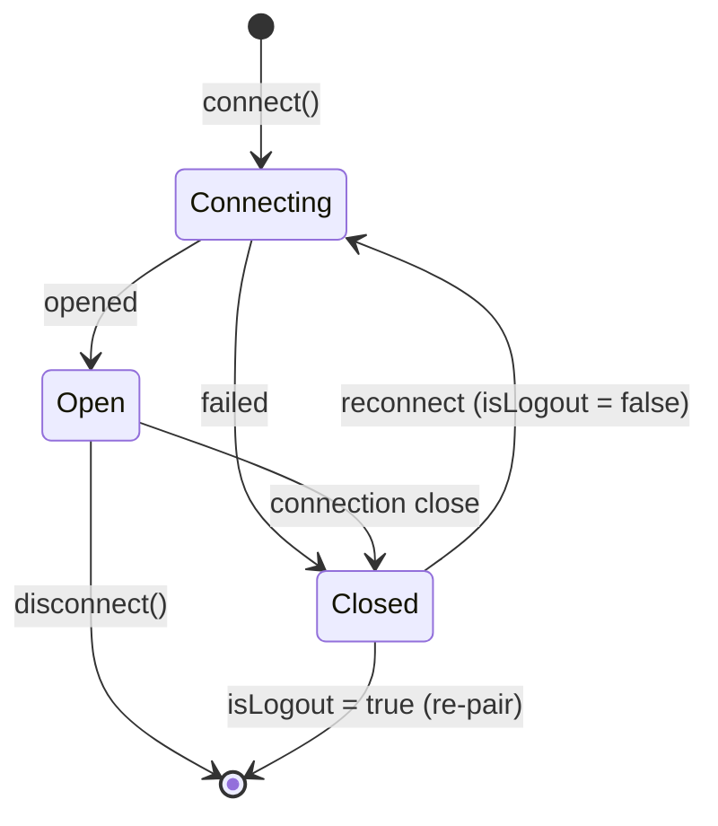

# Reconnection

> zapo does not auto-reconnect by design — follow this pattern to detect dropped sessions, rebuild the client, and resume without duplicate connections.

<Warning>
  `WaClient` does **not** reconnect automatically. This is a deliberate design choice: reconnection policy (backoff, max retries, alerting) belongs to your application. You listen for `connection: close` and decide what to do.
</Warning>

## Internal recovery layers

The "no auto-reconnect" rule applies to the **session lifecycle**: once a `connection: close` event fires, the client will not reopen by itself. Two lower-level retries do live inside the stack though – you will see them in logs and you do not need to handle them.

* **WebSocket transport.** If the socket drops *before* a successful noise handshake, `WaComms` retries internally every `reconnectIntervalMs` (default `2000`) up to `maxReconnectAttempts`. Once the handshake completes, the counter resets and any subsequent drop surfaces as a `connection` event for your app to handle.
* **Pairing transition.** Right after a QR/code pair succeeds, the client restarts the socket as a registered session. No `connection: close` event fires for this – it is invisible from the outside.

The `client_too_old` (HTTP 405) recovery covered below is a third, opt-in layer.

## Connection lifecycle



## The connection event

`connection` is a discriminated union on `status`:

```ts theme={null}
client.on('connection', (event) => {
  if (event.status === 'open') {
    console.log('connected', { isNewLogin: event.isNewLogin })
    return
  }

  // status === 'close'
  console.log('disconnected', {
    reason: event.reason,
    code: event.code,
    isLogout: event.isLogout
  })
})
```

On `close`:

* **`isLogout: true`** — the device was unlinked (server-side logout). Do **not** reconnect; the credentials are gone and you must re-pair.
* **`isLogout: false`** — a transient drop. Safe to reconnect with the stored credentials.

## A reconnection loop with backoff

```ts theme={null}
const MAX_ATTEMPTS = 10

async function connectWithRetry(client: WaClient) {
  let attempt = 0

  client.on('connection', (event) => {
    if (event.status === 'open') {
      attempt = 0 // reset backoff on a healthy connection
      return
    }
    if (event.isLogout) {
      console.error('logged out — re-pairing required')
      return
    }
    void reconnect()
  })

  async function reconnect() {
    if (attempt >= MAX_ATTEMPTS) {
      console.error('giving up after', attempt, 'attempts')
      return
    }
    const delayMs = Math.min(30_000, 1_000 * 2 ** attempt)
    attempt += 1
    console.log(`reconnecting in ${delayMs}ms (attempt ${attempt})`)
    await new Promise((r) => setTimeout(r, delayMs))
    try {
      await client.connect()
    } catch (err) {
      console.error('reconnect failed', err)
      void reconnect()
    }
  }

  await client.connect()
}
```

## Recovering from `client_too_old` (HTTP 405)

If the server starts rejecting the noise handshake with `failure_client_too_old`, the bundled WA Web version is out of date. Two options:

* Set [`recoverFromClientTooOld: true`](/en/concepts/configuration#whatsapp-web-version) on `WaClient` — on every 405 the client fetches the current version from `web.whatsapp.com`, swaps it in, and reconnects.
* Pass a [`version` resolver](/en/concepts/configuration#whatsapp-web-version) that returns a fresh string per connect.

Both are stopgaps — upgrade zapo when a release ships with a refreshed default.

## After reconnecting

Some state is **connection-scoped** and must be re-established after a successful reconnect:

* **Presence subscriptions** — re-`subscribe()` to any contacts you were watching ([Presence](/en/guides/presence-status#subscribing-to-a-contact)).
* **Newsletter live updates** — re-`subscribeLiveUpdates()` if you rely on them.

Persisted state (credentials, Signal sessions, [app-state](/en/reference/glossary#app-state)) is restored from the [store](/en/concepts/stores) automatically — you do **not** re-pair on a normal reconnect.

## Graceful shutdown

Call `disconnect()` for a clean shutdown that keeps credentials so you can resume later:

```ts theme={null}
process.on('SIGINT', async () => {
  await client.disconnect()
  process.exit(0)
})
```

This flushes pending write-behind data and closes the socket without unlinking the device.
